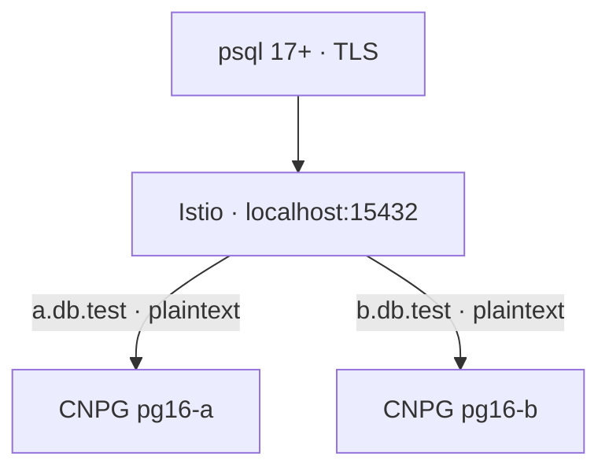

# Istio SNI → PostgreSQL 16 on kind

Two CloudNativePG clusters behind one Istio ingress port. Istio terminates TLS
and routes by SNI; PostgreSQL 16 receives **plaintext** and authenticates with
SCRAM passwords.



Both clusters use database `app` and user `demo`, with different passwords.
The application HBA rule is `hostnossl app demo all scram-sha-256`, followed by
`host all all all reject`. Application connections to PostgreSQL are unencrypted.
**CNPG fixes global `ssl=on` for internal use; this demo does not disable its
TLS listener.** Tests assert `pg_stat_ssl.ssl=false` for application sessions.

## Run

Requires Docker, kind, kubectl, Helm, OpenSSL, Bash, and about 4–6 GB of Docker
memory. The demo binds only to loopback and uses its own `.state/kubeconfig`.

```sh
./scripts/up.sh
./scripts/verify.sh
./scripts/psql.sh a -c 'SELECT * FROM cluster_identity'
./scripts/psql.sh b -c 'SELECT * FROM cluster_identity'
```

`up.sh` installs pinned versions and creates two single-instance PostgreSQL 16.13
clusters with 1 GiB volumes. It can be rerun. Passwords and gateway certificates
are generated in gitignored `.state/`. Certificates last 30 days; remove
`.state/gateway/` and rerun `up.sh` to renew them.

The helper uses a PostgreSQL 17.9 client container. **The client needs version
17+ for `sslnegotiation=direct`; the server is version 16.** Istio must receive a
TLS ClientHello immediately to inspect SNI. The included EnvoyFilter configures
`postgresql` ALPN on the gateway, as required by libpq direct TLS.

With local psql 17+, connect through the host port:

```sh
PGPASSWORD="$(cat .state/passwords/a)" psql -X -w \
  "host=a.db.test hostaddr=127.0.0.1 port=15432 dbname=app user=demo sslmode=verify-full sslnegotiation=direct sslrootcert=$PWD/.state/client/a/server-ca.crt connect_timeout=5"
```

For B, change the hostname and both credential paths from `a` to `b`. No DNS
changes are needed: `hostaddr` sets the address, while `host` supplies SNI and
the certificate hostname. The container helper reaches the same gateway via
the kind node's NodePort, which works on Linux and Docker Desktop.

## Configuration and checks

- `manifests/routing.yaml`: SNI gateways, TCP routes, plaintext upstreams, ALPN.
- `scripts/up.sh`: CNPG clusters and password authentication rules.
- `scripts/verify.sh`: both backend identities, PostgreSQL major version 16,
  plaintext sessions, and rejection of wrong/missing passwords, wrong CA,
  unknown/missing SNI, and legacy TLS negotiation.

The identity table returns `pg-a` or `pg-b` for the corresponding cluster.
The nine checks have been verified against PostgreSQL 16.13. There are no
sidecars on the database pods and no client certificate authentication.

## Cleanup

```sh
./scripts/down.sh
```

Deletes the kind cluster and its database volumes. Local credentials remain
in `.state/`. This is a local demo, with no database high availability.

Inspired by [GEICO's PostgreSQL SPIFFE example](https://github.com/geico/database-spiffe-auth-examples/tree/main/postgres),
using password authentication in place of SPIFFE/SPIRE integration.
See [Istio TLS configuration](https://istio.io/latest/docs/ops/configuration/traffic-management/tls-configuration/),
[libpq connection parameters](https://www.postgresql.org/docs/17/libpq-connect.html),
and [CNPG fixed settings](https://cloudnative-pg.io/docs/1.30/postgresql_conf/).
