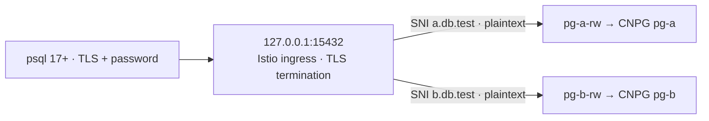

# PostgreSQL SNI routing with Istio and CloudNativePG on kind

One local port, two PostgreSQL clusters, password authentication:



SNI chooses the cluster. PostgreSQL verifies its own SCRAM password. Both
clusters use database `app` and role `demo`, with distinct random passwords.
TLS terminates at Istio; the client verifies the gateway certificate and
hostname. Istio forwards plaintext PostgreSQL to the selected cluster. No client
certificate is required. An unknown SNI has no route.

**CNPG does not support setting PostgreSQL's global `ssl` parameter to `off`.**
It fixes `ssl=on` for its managed servers. This demo instead enforces plaintext
for the application role with `hostnossl app demo all scram-sha-256`, followed by
a reject rule. `pg_stat_ssl.ssl` is false for application sessions, while
`SHOW ssl` remains on. CNPG's internal certificate-based rules remain managed
by the operator. Globally disabling the server's TLS listener would require a
PostgreSQL deployment outside this supported CNPG configuration.

## Run

Prerequisites: Docker, kind, kubectl, Helm, OpenSSL, Bash; approximately 4–6 GB
of Docker memory and internet access for images and charts. Ports bind only to
loopback. Scripts use a dedicated kubeconfig in `.state/`.

```sh
./scripts/up.sh
./scripts/verify.sh
./scripts/psql.sh a -c 'SELECT * FROM cluster_identity'
./scripts/psql.sh b -c 'SELECT * FROM cluster_identity'
```

`up.sh` creates `cnpg-sni-demo`, installs Istio and CNPG with pinned versions
in `scripts/common.sh`, and creates two single-instance clusters with 1 GiB
volumes. It can be rerun. Passwords are retained in `.state/passwords/`; bootstrap
secrets are not a password rotation mechanism for an existing database.
`gateway-certs.sh` creates separate demo CAs and gateway certificates, valid for
30 days. To renew, remove `.state/gateway/` and rerun `up.sh`; client CA files
are refreshed automatically.

The helper runs a PostgreSQL 17 client container in the kind node's network
namespace, reaching the ingress NodePort on `127.0.0.1:30432`. This avoids
Docker Desktop host-network dependencies. The kind port mapping exposes the
same gateway on your host at `127.0.0.1:15432`.

With a **local psql 17 or newer**, connect directly through that host port:

```sh
PGPASSWORD="$(cat .state/passwords/a)" psql -X -w \
  "host=a.db.test hostaddr=127.0.0.1 port=15432 dbname=app user=demo sslmode=verify-full sslnegotiation=direct sslrootcert=$PWD/.state/client/a/server-ca.crt connect_timeout=5" \
  -c 'SELECT * FROM cluster_identity'
```

For cluster B, change `a.db.test` to `b.db.test` and both `/a` paths to `/b`.
`hostaddr` sets the network address; `host` sets SNI and the verified hostname.
No DNS or `/etc/hosts` changes are needed.

**`sslnegotiation=direct` is essential.** Traditional PostgreSQL TLS begins with
an SSLRequest rather than a TLS ClientHello, so Istio cannot inspect SNI at
connection start. The default server and client are version 17, but only the client needs direct
TLS support: a PostgreSQL 16 backend also works with gateway termination.
Older clients need a TLS-aware intermediary or a different routing design.

## Verification and inspection

`verify.sh` checks both backend identity rows and asserts `pg_stat_ssl.ssl=false`
and the CNPG global `ssl=on` setting, plus cross-cluster and missing password rejection,
untrusted server CA rejection, unknown/missing SNI rejection, and failure of
traditional PostgreSQL TLS negotiation. Failures must match the expected error,
so an unrelated container failure does not count as success.

```sh
export KUBECONFIG="$PWD/.state/kubeconfig"
kubectl -n databases get clusters,pods,svc
kubectl -n databases get gateway,virtualservice,destinationrule
kubectl -n databases logs pg-a-1
kubectl -n istio-system logs deploy/istio-ingressgateway
```

Routing is in `manifests/routing.yaml`; cluster definitions and SCRAM HBA rules
are in `scripts/up.sh`. Database pods have no Istio sidecars. The destination
rule disables upstream TLS, so PostgreSQL receives plaintext. Separate Gateway
resources bind each SNI hostname to its own TCP VirtualService route.

Istio 1.30 needs the included, gateway-scoped `EnvoyFilter` to advertise
`postgresql` ALPN on port 5432; libpq direct TLS rejects a TLS terminator that
does not negotiate this protocol. Revalidate this filter when upgrading Istio.
Gateway certificate secrets live in `istio-system`. CNPG's own certificates
are not used by these application connections.

Tested on kind: both routes returned their expected cluster and `ssl=false`;
all nine verification checks passed. A server-side dry run of `ssl=off` was
rejected by CNPG with `Can't set fixed configuration parameter`.

## Verify PostgreSQL 16 compatibility

```sh
./scripts/verify-pg16.sh
```

This creates fresh `pg16-a` and `pg16-b` CNPG clusters using PostgreSQL 16.13,
with separate volumes and the existing demo passwords. It temporarily switches
both SNI routes to these backends, asserts server major version 16 and plaintext
backend sessions, and runs all nine routing/authentication checks using the
PostgreSQL 17.9 client. It restores the original routes on exit, including when
a check fails. Run it after `up.sh`, without concurrent routing changes.

Verified: all nine checks passed on PostgreSQL 16.13; both backend sessions
reported `pg_stat_ssl.ssl=false`. The original PostgreSQL 17 data is untouched.
The PG16 clusters remain available for inspection until `down.sh` removes the
kind cluster. Detailed output from the verification run is in
`.state/pg16-test.log` (local, gitignored).

## Cleanup

```sh
./scripts/down.sh
```

This deletes the demo kind cluster **and its database volumes**. `.state/`
retains local credentials and is gitignored; remove it for a fresh set of passwords.
This is a local routing demo with one database instance per cluster, not HA.

## Reference and design

Inspired by [GEICO's PostgreSQL SPIFFE example](https://github.com/geico/database-spiffe-auth-examples/tree/main/postgres).
That example uses SPIRE, paired Envoys, Wasm credential injection, and PAM JWT
validation. Here, ordinary PostgreSQL password authentication keeps the scope
to SNI routing; there is no SPIFFE/SPIRE identity integration.

- [Istio gateway TLS configuration](https://istio.io/latest/docs/ops/configuration/traffic-management/tls-configuration/)
- [PostgreSQL 17 connection parameters: direct TLS, SNI, hostaddr](https://www.postgresql.org/docs/17/libpq-connect.html)
- [CloudNativePG certificate management](https://cloudnative-pg.io/docs/1.30/certificates/)

- [CNPG fixed PostgreSQL configuration parameters](https://cloudnative-pg.io/docs/1.30/postgresql_conf/)
